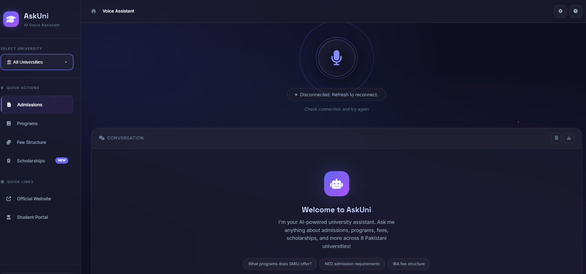

<div align="center">

# AskUni AI Voice Agent

### Intelligent Voice-Powered University Assistant

[](https://huggingface.co/spaces/zahidforai/askuni-voice-agent)

**[Live Demo](https://zahidforai-askuni-voice-agent.hf.space/)** 



---

</div>

## Overview

**AskUni** is a cutting-edge conversational AI system that revolutionizes how students interact with university information. By combining advanced natural language processing, voice recognition, and retrieval-augmented generation, AskUni delivers precise, contextually aware responses about academic programs, admissions, and university services.

### Key Highlights

<div align="center">

### System Architecture

</div>

```
┌─────────────────────────────────────────────────────────────┐
│                     Frontend Layer                          │
│  ┌──────────────┐  ┌──────────────┐  ┌──────────────┐     │
│  │ Voice Input  │  │ Text Input   │  │ WebSocket    │     │
│  │ Interface    │  │ Interface    │  │ Client       │     │
│  └──────────────┘  └──────────────┘  └──────────────┘     │
└─────────────────────────────────────────────────────────────┘
                            │
                            ▼
┌─────────────────────────────────────────────────────────────┐
│                    Application Layer                        │
│  ┌──────────────────────────────────────────────────┐      │
│  │         FastAPI WebSocket Server                 │      │
│  │  ┌────────────┐  ┌────────────┐  ┌────────────┐│      │
│  │  │ Intent     │  │ Query      │  │ Navigation ││      │
│  │  │ Detection  │  │ Processing │  │ Handler    ││      │
│  │  └────────────┘  └────────────┘  └────────────┘│      │
│  └──────────────────────────────────────────────────┘      │
└─────────────────────────────────────────────────────────────┘
                            │
                            ▼
┌─────────────────────────────────────────────────────────────┐
│                      AI/ML Layer                            │
│  ┌──────────────────────────────────────────────────┐      │
│  │            RAG Pipeline (LangChain)              │      │
│  │  ┌────────────┐  ┌────────────┐  ┌────────────┐│      │
│  │  │ Document   │  │ Embedding  │  │ Similarity ││      │
│  │  │ Chunking   │  │ Generation │  │ Search     ││      │
│  │  └────────────┘  └────────────┘  └────────────┘│      │
│  └──────────────────────────────────────────────────┘      │
│  ┌──────────────────────────────────────────────────┐      │
│  │              Groq LLM Engine                     │      │
│  │           (Qwen 3 / Llama 3 Models)              │      │
│  └──────────────────────────────────────────────────┘      │
└─────────────────────────────────────────────────────────────┘
                            │
                            ▼
┌─────────────────────────────────────────────────────────────┐
│                      Data Layer                             │
│  ┌──────────────────────────────────────────────────┐      │
│  │          FAISS Vector Database                   │      │
│  │      (High-Performance Similarity Search)        │      │
│  └──────────────────────────────────────────────────┘      │
│  ┌──────────────────────────────────────────────────┐      │
│  │        University Knowledge Base (.txt)          │      │
│  │    SMIU • NED • IBA • UOK • FAST • SZABIST      │      │
│  └──────────────────────────────────────────────────┘      │
└─────────────────────────────────────────────────────────────┘
```

---

## Features

<table>
<tr>
<td width="50%">

#### Natural Interaction
- **Voice Recognition**: Seamless speech-to-text conversion for hands-free queries
- **Text Input**: Traditional typed queries with full contextual understanding
- **Real-time Processing**: WebSocket-powered instant communication
- **Context Awareness**: Maintains conversation history for follow-up questions

</td>
<td width="50%">

#### Intelligent Retrieval
- **RAG Architecture**: Combines knowledge base search with generative AI
- **Multi-Source Data**: Aggregates information from multiple university documents
- **Semantic Search**: Understands query intent, not just keywords
- **Hallucination Prevention**: Grounded responses based on verified data

</td>
</tr>
<tr>
<td width="50%">

#### University Coverage
- **SMIU** (Sindh Madressatul Islam University)
- **NED** University of Engineering & Technology
- **IBA** (Institute of Business Administration)
- **UOK** (University of Karachi)
- **FAST** NUCES
- **SZABIST**
- **DHA Suffa** University
- **DUET** (Dawood University)

</td>
<td width="50%">

#### Smart Capabilities
- **Comparison Analysis**: Side-by-side program and fee comparisons
- **Auto-Navigation**: Direct links to relevant university portals
- **Query Understanding**: Handles complex, multi-part questions
- **Response Formatting**: Clear, structured, and actionable answers

</td>
</tr>
</table>

---

## Technology Stack

<div align="center">

| Category | Technologies |
|----------|-------------|
| **Backend Framework** |   |
| **AI/LLM** |   |
| **Vector Database** |  |
| **Embeddings** |  |
| **Communication** |  |
| **Frontend** |   |
| **Deployment** |   |

</div>

---

## Getting Started

### Prerequisites

Before you begin, ensure you have the following installed:

- Python 3.9 or higher
- pip (Python package manager)
- Git
- A Groq API key ([Get one here](https://console.groq.com/))

### Quick Installation

#### Method 1: Standard Setup

```bash
# Clone the repository
git clone https://github.com/yourusername/AskUni-Voice-Agent.git
cd AskUni-Voice-Agent

# Create virtual environment (recommended)
python -m venv venv
source venv/bin/activate  # On Windows: venv\Scripts\activate

# Install dependencies
pip install -r requirements.txt

# Configure environment variables
cp .env.example .env
# Edit .env and add your GROQ_API_KEY

# Run the application
python main.py
```

#### Method 2: Docker Deployment

```bash
# Build the Docker image
docker build -t askuni-agent .

# Run the container
docker run -p 8080:8080 --env-file .env askuni-agent
```

#### Method 3: Docker Compose

```bash
# Start all services
docker-compose up -d

# View logs
docker-compose logs -f

# Stop services
docker-compose down
```

### Configuration

Create a `.env` file in the root directory:

```env
# Required
GROQ_API_KEY=your_groq_api_key_here

# Optional
PORT=8080
HOST=0.0.0.0
MODEL_NAME=llama3-70b-8192
CHUNK_SIZE=1000
CHUNK_OVERLAP=200
```

### Data Preparation

Organize your university data files in the following structure:

```
UNIVERSITY/
├── SMIU/
│   ├── admission.txt
│   ├── programs.txt
│   ├── fee_structure.txt
│   └── history.txt
├── NED/
│   ├── engineering_programs.txt
│   ├── admission_criteria.txt
│   └── contact.txt
├── IBA/
│   ├── business_programs.txt
│   └── scholarships.txt
└── ...
```

**Data Format Guidelines:**
- Use plain text (.txt) files
- Structure content with clear headings
- Include relevant keywords for better retrieval
- Update files regularly for accuracy

---

## Usage Guide

### Starting the Server

```bash
python main.py
```

The server will:
1. Load environment variables
2. Initialize the vector database (first run may take a few minutes)
3. Start the WebSocket server on `http://localhost:8080`

### Interacting with AskUni

Access the web interface at `http://localhost:8080` and try these example queries:

**Admission Queries:**
```
"What are the admission requirements for Computer Science at FAST?"
"When do applications open for NED University?"
"Show me the eligibility criteria for MBA at IBA"
```

**Program Comparisons:**
```
"Compare the CS programs at FAST and NED"
"What's the difference between Software Engineering at SMIU and DHA Suffa?"
"Which university offers the best business programs?"
```

**Fee Information:**
```
"What is the fee structure for Engineering at NED?"
"Compare tuition fees between IBA and SZABIST"
"Are there any scholarships available at UOK?"
```

**Navigation Requests:**
```
"Open the admission portal for FAST"
"Take me to SMIU's student portal"
"Show me the fee payment page for IBA"
```

### API Endpoints

| Endpoint | Method | Description |
|----------|--------|-------------|
| `/` | GET | Web interface |
| `/ws` | WebSocket | Real-time chat connection |
| `/health` | GET | Service health check |
| `/vector-db/rebuild` | POST | Rebuild vector database |

### Advanced Features

#### Custom Prompts

Modify the system prompt in `groq_rag.py` to customize AskUni's behavior:

```python
SYSTEM_PROMPT = """
You are AskUni, an expert university advisor with deep knowledge of...
[Customize based on your needs]
"""
```

#### Adding New Universities

1. Create a new folder in `UNIVERSITY/`
2. Add relevant text files
3. Restart the server to rebuild the vector database

---

## Project Structure

```
AskUni-Voice-Agent/
├── UNIVERSITY/              # Knowledge base directory
│   ├── SMIU/
│   ├── NED/
│   ├── IBA/
│   └── ...
├── faiss_index/             # Vector database (auto-generated)
│   ├── index.faiss
│   └── index.pkl
├── main.py                  # FastAPI server & WebSocket logic
├── groq_rag.py              # RAG implementation
├── index.html               # Frontend interface
├── requirements.txt         # Python dependencies
├── Dockerfile               # Docker configuration
├── docker-compose.yml       # Multi-container setup
├── .env.example             # Environment variables template
├── .gitignore              # Git ignore rules
└── README.md               # This file
```

---

## Performance Optimization

### Vector Database

The FAISS index is optimized for:
- **Fast similarity search** (< 100ms for most queries)
- **Efficient memory usage** (compressed embeddings)
- **Scalable storage** (supports thousands of documents)

### LLM Inference

Groq's infrastructure provides:
- **Ultra-low latency** (< 500ms response time)
- **High throughput** (hundreds of tokens per second)
- **Cost efficiency** (competitive pricing)

### Best Practices

1. **Chunk Size**: Keep document chunks between 500-1500 characters
2. **Overlap**: Use 10-20% overlap between chunks for context continuity
3. **Caching**: Implement response caching for frequently asked questions
4. **Rate Limiting**: Configure request limits to manage API costs

---

## Deployment

### Render

1. Push your code to GitHub
2. Create a new Web Service on [Render](https://render.com)
3. Connect your repository
4. Add environment variables
5. Deploy

### Heroku

```bash
heroku create askuni-agent
heroku config:set GROQ_API_KEY=your_key_here
git push heroku main
```

### AWS EC2

```bash
# SSH into your instance
ssh -i your-key.pem ubuntu@your-instance-ip

# Clone and setup
git clone https://github.com/yourusername/AskUni-Voice-Agent.git
cd AskUni-Voice-Agent
docker-compose up -d
```

---

## Troubleshooting

### Common Issues

**Issue: Vector database not generating**
```bash
# Solution: Manually rebuild
python -c "from groq_rag import initialize_rag; initialize_rag()"
```

**Issue: WebSocket connection failed**
```bash
# Solution: Check firewall settings
sudo ufw allow 8080/tcp
```

**Issue: Groq API errors**
```bash
# Solution: Verify API key and check quota
echo $GROQ_API_KEY
```

### Debug Mode

Enable detailed logging:

```python
# In main.py
import logging
logging.basicConfig(level=logging.DEBUG)
```

---

## Roadmap

- [ ] Multi-language support (Urdu, Sindhi)
- [ ] Integration with university APIs for real-time data
- [ ] Mobile application (iOS & Android)
- [ ] Analytics dashboard for administrators
- [ ] Voice output (Text-to-Speech)
- [ ] Image-based query support (upload documents)
- [ ] Calendar integration for important dates
- [ ] Chat history and bookmarks
- [ ] Personalized recommendations based on user profile

---

## Contributing

We welcome contributions from the community! Here's how you can help:

### Development Workflow

1. Fork the repository
2. Create your feature branch (`git checkout -b feature/AmazingFeature`)
3. Commit your changes (`git commit -m 'Add some AmazingFeature'`)
4. Push to the branch (`git push origin feature/AmazingFeature`)
5. Open a Pull Request

### Contribution Guidelines

- Follow PEP 8 style guide for Python code
- Write clear commit messages
- Add tests for new features
- Update documentation as needed
- Ensure all tests pass before submitting PR

### Areas for Contribution

- Adding support for new universities
- Improving RAG accuracy
- Enhancing UI/UX
- Writing documentation
- Creating test cases
- Performance optimization

---

## Testing

### Run Unit Tests

```bash
pytest tests/ -v
```

### Run Integration Tests

```bash
pytest tests/integration/ -v
```

### Test Coverage

```bash
pytest --cov=. --cov-report=html
```

---

## Security

### Reporting Vulnerabilities

If you discover a security vulnerability, please email [zahidforai@gmail.com](mailto:zahidforai@gmail.com). Do not create public issues for security concerns.

### Security Measures

- API keys stored in environment variables
- Input sanitization for all user queries
- Rate limiting on API endpoints
- Regular dependency updates
- HTTPS enforcement in production

---

## License

This project is licensed under the MIT License - see the [LICENSE](LICENSE) file for details.

```
MIT License

Copyright (c) 2026 Zahid

Permission is hereby granted, free of charge, to any person obtaining a copy
of this software and associated documentation files (the "Software"), to deal
in the Software without restriction, including without limitation the rights
to use, copy, modify, merge, publish, distribute, sublicense, and/or sell
copies of the Software, and to permit persons to whom the Software is
furnished to do so, subject to the following conditions:

[Full license text...]
```

---

## Acknowledgments

### Technologies

- **Groq** for providing lightning-fast LLM inference
- **LangChain** for the powerful RAG framework
- **Meta** for the Llama 3 model
- **Facebook AI** for FAISS vector search
- **HuggingFace** for embedding models

### Inspiration

This project was developed as part of a Final Year Project (FYP) 2026, with the goal of making university information more accessible to students across Pakistan.

## Contact & Support

<div align="center">

### Get in Touch

**Developer:** Zahid  
**Project:** FYP 2026

[](https://github.com/ZahidforAI)
[](https://linkedin.com/in/zahidaliai)
[](mailto:zahidforai@gmail.com)

### Support the Project

If you find AskUni helpful, please consider:
- Starring the repository
- Sharing with fellow students and developers
- Contributing to the codebase
- Reporting bugs and suggesting features

---

**Made with passion by students, for students**

*Empowering education through intelligent conversation*

</div>
